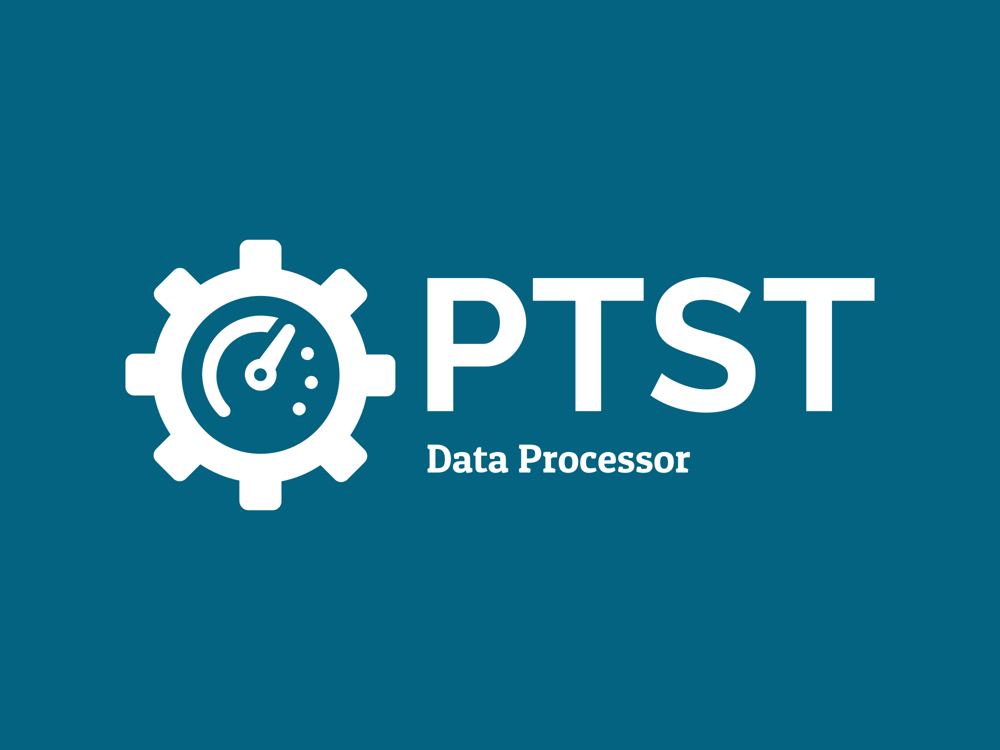

Download latest results and process them into summaries for data analysis and ML modelling.

# Command Usage
```shell
python data_processor.py <config_json>
```
Example:
```shell
python data_processor.py controllers.json
```

# Config File
Contains a list of controllers and local dirpath where to put downloaded data.
```json
[
    {
        "name": ...,
        "ip": ...,
        "ptstdir": ...,
        "outputdir": ...
    },
    ...
]
```

**`name`: `string`**
Name of the controller.

**`ip`: `string`**
IP address of the controller.

**`ptstdir`: `string`**
Filepath to PTST dir on controller.

**`outputdir`: `string`**
Folder path pointing to location for storing downloaded data on local machine.

Example Config:
```json
[
    {
        "name": "3Pi",
        "ip": "34.56.245.1",
        "ptstdir": "/home/my_username/Documents/PTST",
        "outputdir": "Documents\\phd_data\\3pi\\ml_data"
    },
    {
        "name": "5Pi",
        "ip": "98.58.211.101",
        "ptstdir": "/home/my_username/Documents/PTST",
        "outputdir": "Documents\\phd_data\\5pi\\ml_data"
    }
]
```

# How does it work?
For each machine find any new zips in the `ptstdir` and download them if they don't already exist in the `outputdir` directory.
For any newly downloaded zips do the following:
1. Unzip it.
2. Get the usable tests.
3. Summarise the usable test data into a single file for that test (do for all tests).
4. Generate ML summary file for all tests.