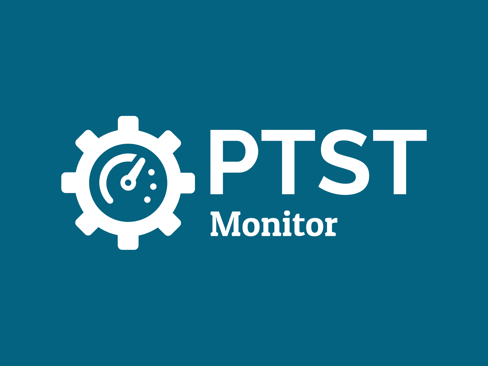
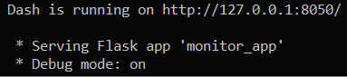
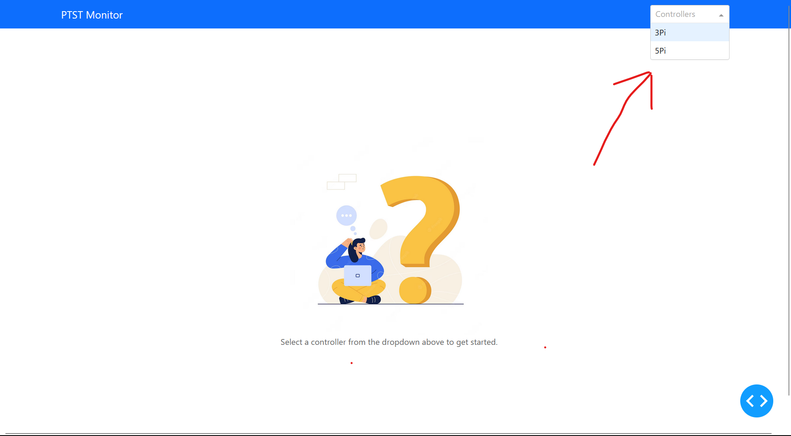
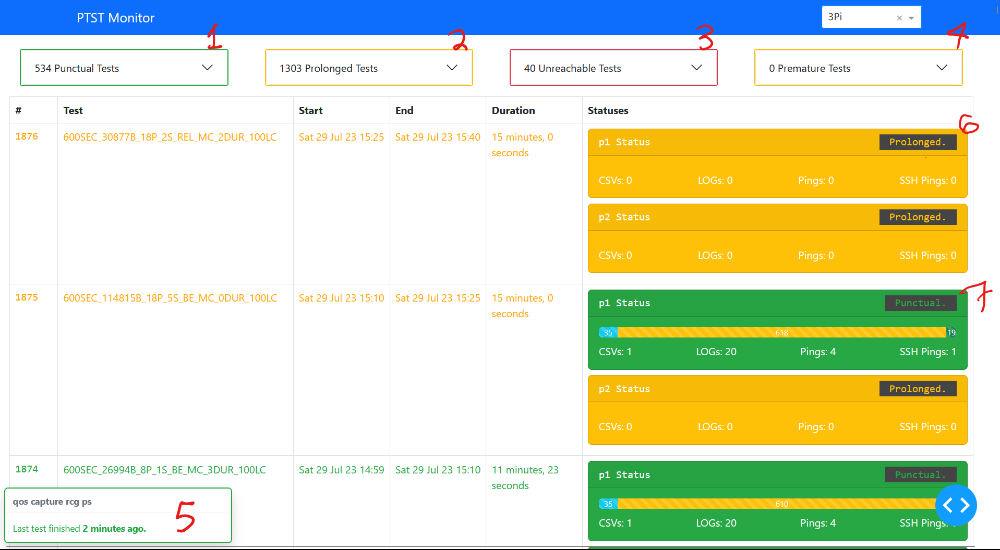

# Table of Contents
- [Table of Contents](#table-of-contents)
- [Command Usage](#command-usage)
- [Test Types](#test-types)

# Command Usage
```shell
python monitor.py <controllers_config_json>
```
Example:
```shell
python monitor.py controllers.json
```

Once you run the command you should see something similar to this:


Head to the IP given and you should see the following:


All controllers will be found in the dropdown on the top right:


When you click on a controller it will load up the test statuses:


`1`: List of test names that were punctual.
`2`: List of test names that were prolonged.
`3`: List of test names that were unreachable.
`4`: List of test names that were premature.
`5`: How long has it been since the last test finished.
`6`: Prolonged status of each machine used in the test.
`7`: Punctual status of each machine used in the test.

# Test Types

**Punctual Tests**: Tests that run within the time allocated to them e.g. if you defined a `duration_s` to `600` seconds a `buffer_duration` to `120` seconds then a punctual test would take no longer than `600 + 120` seconds = `12 minutes`.

**Prolonged Tests**: Tests that took longer than the defined `buffer_duration` and were therefore interrupted because of the timeout.

**Unreachable Tests**: Tests where the initial pings to each machine resulted in the machines being unreachable i.e. the tool pings the machine up to `x` times and if there is no response we identify the test as unreachable.

**Premature Tests**: Tests that finished in a period that was shorter than the defined `duration_s`, e.g. if the test ran completed in `60` seconds when a `duration_s` of `600` was defined.